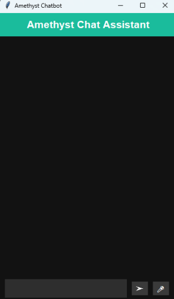
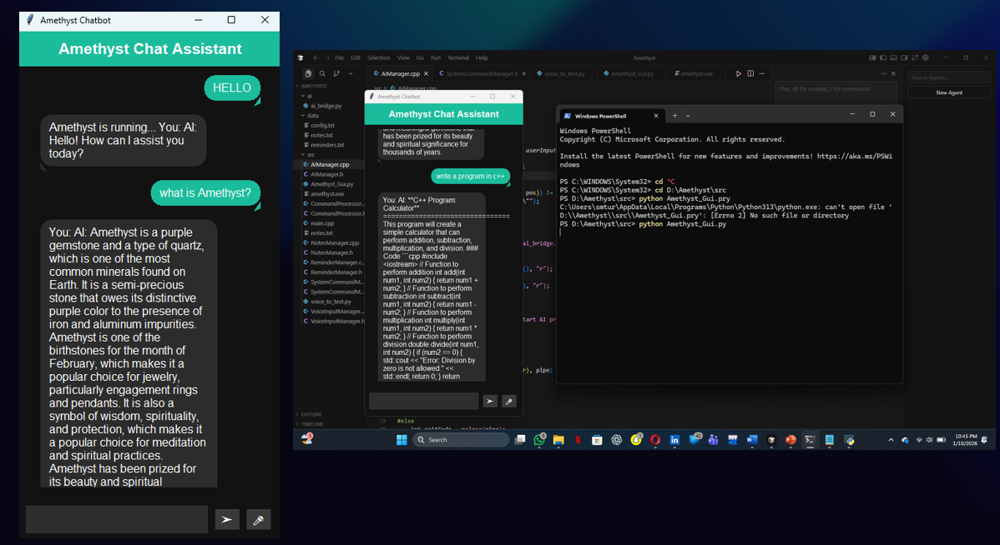
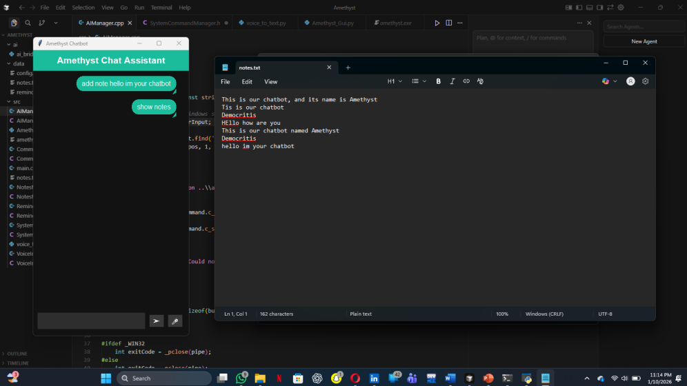
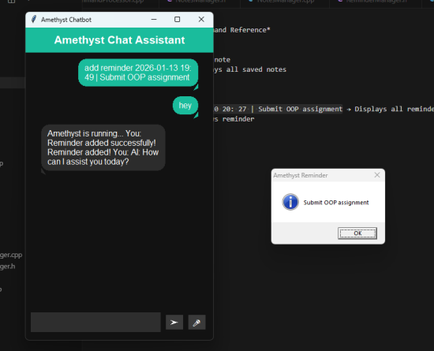
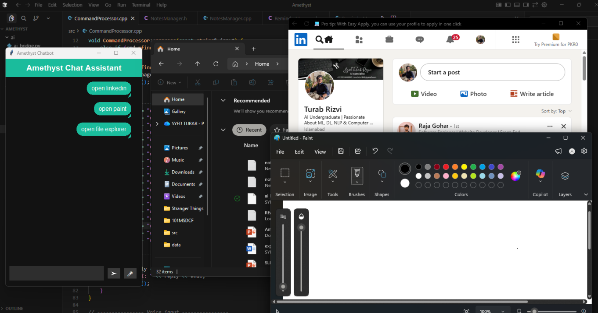
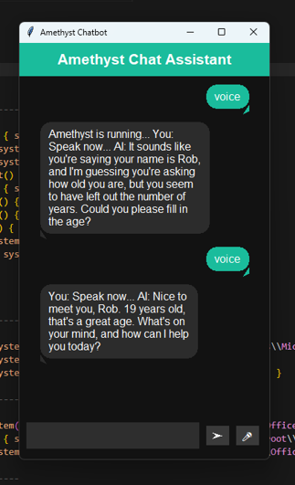

<div align="center">

# 🤖 Amethyst — AI Personal Desktop Assistant

**A natural language-based desktop assistant that lets you control your computer by just talking to it.**

[](https://isocpp.org/)
[](https://python.org/)
[](https://docs.python.org/3/library/tkinter.html)
[-green?style=for-the-badge)](https://alphacephei.com/vosk/)
[](https://www.microsoft.com/windows)

*Built by **Syed Turab Rizvi***

---



</div>

---

## 📌 Table of Contents

- [Overview](#-overview)
- [The Problem](#-the-problem)
- [Features](#-features)
- [Screenshots](#-screenshots)
- [System Architecture](#-system-architecture)
- [Tech Stack](#-tech-stack)
- [Project Structure](#-project-structure)
- [Modules](#-modules)
- [Supported Voice & Text Commands](#-supported-voice--text-commands)
- [Data Storage](#-data-storage)
- [Future Scope](#-future-scope)

---

## 🌟 Overview

**Amethyst** is an intelligent, modular desktop assistant designed to replace tedious manual interaction with natural, conversational commands. Instead of clicking through menus and opening apps one by one, you simply type or speak — and Amethyst handles it.

It combines the raw power of **C++** for system-level operations with the intelligence of **Python** for AI responses and voice recognition, all wrapped in a clean, mobile-inspired dark-theme GUI built with **Tkinter**.

---

## ❗ The Problem

Traditional desktop environments still force users to:

| Problem | Reality |
|---|---|
| 📝 Managing notes | Requires opening a separate application |
| ⏰ Setting reminders | Involves multiple steps and menus |
| 📂 Opening apps | Requires manual navigation or searching |
| 🎙️ Voice interaction | Usually cloud-dependent and privacy-invasive |
| 🤖 Smart responses | Existing tools lack deep system integration |

**Amethyst solves all of this from a single chat window.**

---

## ✨ Features

| Feature | Description |
|---|---|
| 💬 Natural Language Input | Type commands the way you speak — no rigid syntax |
| 🎙️ Offline Voice Recognition | Speak directly to the assistant using Vosk (no internet needed) |
| 📝 Notes Manager | Add and view persistent notes without leaving the chat |
| ⏰ Reminder Manager | Set time-based reminders; get pop-up notifications when they're due |
| 🖥️ System Automation | Open 15+ apps (VS Code, Chrome, Excel, Spotify, etc.) by voice or text |
| 🤖 AI Fallback | Unrecognized commands are answered intelligently via Groq (LLaMA 3.1) |
| 🎨 Modern Dark UI | Mobile-inspired chat bubbles, teal accents, auto-scroll |

---

## 📸 Screenshots

### Main Interface


---

### 💬 AI Chat — Text Conversation


---

### 📝 Notes Manager


---

### ⏰ Reminder Manager


---

### 🖥️ System Automation — Opening Apps


---

### 🎙️ Voice Integration


---

## 🏗️ System Architecture

Amethyst follows a clean **5-layer architecture**, where every layer has a clearly defined responsibility:

```
┌─────────────────────────────────────────┐
│         User Interface Layer            │
│         Tkinter GUI (Python)            │
│  [Text Input]           [Voice Input]   │
└──────────────┬──────────────────────────┘
               │
┌──────────────▼──────────────────────────┐
│       Command Processor (C++)           │
│       Parse & Route Commands            │
└──────────────┬──────────────────────────┘
               │
┌──────────────▼──────────────────────────┐
│          Manager Modules Layer          │
│  [Notes]  [Reminders]  [System Cmds]   │
└──────────────┬──────────────────────────┘
               │
┌──────────────▼──────────────────────────┐
│           AI & Voice Layer              │
│  [AI Module (Python)]  [Vosk Voice]    │
└──────────────┬──────────────────────────┘
               │
┌──────────────▼──────────────────────────┐
│          Data Storage Layer             │
│    notes.txt        reminders.txt       │
└─────────────────────────────────────────┘
```

### Data Flow

```
User Input (text/voice)
    → GUI sends to C++ backend
        → CommandProcessor analyzes & routes
            → Module executes action
                → Response returned to GUI
```

---

## 🛠️ Tech Stack

| Technology | Role | Why |
|---|---|---|
| **C++** | Core backend engine | Fast execution, direct OS access, process control |
| **Python** | AI, Voice & GUI | Rich ecosystem, easy library integration |
| **Tkinter** | Graphical interface | Lightweight, native look, no extra dependencies |
| **Vosk** | Offline speech recognition | No internet needed, privacy-friendly, lightweight model |
| **Groq API (LLaMA 3.1)** | AI fallback responses | Fast inference, conversational intelligence |

---

## 📁 Project Structure

```
AMETHYST/
│
├── ai/
│   └── ai_bridge.py              # Python AI script (Groq API)
│
├── data/
│   ├── config.txt
│   ├── notes.txt                 # Persistent notes storage
│   └── reminders.txt             # Persistent reminders storage
│
├── src/
│   ├── AIManager.cpp / .h        # AI integration module
│   ├── CommandProcessor.cpp / .h # Central command router
│   ├── NotesManager.cpp / .h     # Notes CRUD
│   ├── ReminderManager.cpp / .h  # Reminder scheduling & notifications
│   ├── SystemCommandManager.cpp / .h  # App launcher
│   ├── VoiceInputManager.cpp / .h     # Voice bridge
│   ├── voice_to_text.py          # Vosk speech-to-text script
│   ├── Amethyst_Gui.py           # Tkinter GUI
│   └── main.cpp                  # Entry point
│
├── amethyst.exe                  # Compiled backend
└── Readme.txt
```

---

## 🧩 Modules

### 🧠 CommandProcessor
The brain of Amethyst. Every input — typed or spoken — passes through here.

| Responsibility | Detail |
|---|---|
| Receives input | Text or voice, from any source |
| Normalizes text | Converts to lowercase for consistent matching |
| Detects intent | Keyword matching across all modules |
| Routes command | Delegates to the right manager |
| AI fallback | If nothing matches, asks the AI |

---

### 📝 Notes Manager
Save information instantly without leaving the chat.

| Step | Action |
|---|---|
| 1 | User types `add note buy groceries` |
| 2 | Note is appended to `notes.txt` |
| 3 | Notepad opens automatically with updated notes |
| 4 | Notes persist across all sessions |

---

### ⏰ Reminder Manager
Set reminders and get notified via Windows pop-ups.

| Step | Action |
|---|---|
| 1 | User types `add reminder 2026-06-25 18:00 \| Call mom` |
| 2 | Saved to `reminders.txt` with timestamp |
| 3 | System checks after every command |
| 4 | Windows `MessageBoxA` pop-up fires when due |
| 5 | Completed reminders are auto-removed |

---

### 🖥️ System Command Manager
Control your desktop through words.

| Category | Supported Apps |
|---|---|
| 🔧 Windows Built-in | Calculator, Notepad, File Explorer, Task Manager, Paint, Settings, Control Panel, CMD, PowerShell |
| 💻 Development Tools | VS Code, Dev-Cpp, Cursor |
| 📊 Office Suite | Word, PowerPoint, Excel |
| 🌐 Other Apps | Browser, LinkedIn, Spotify, ChatGPT |

> **Security:** Only predefined commands are accepted — no arbitrary code execution.

---

### 🤖 AI Integration
When no command matches, Amethyst falls back to an AI response.

```
C++ (control) → spawns Python subprocess → Groq API (LLaMA 3.1-8b) → response piped back → displayed in GUI
```

- Input is safely escaped before passing to shell
- Output is captured via pipes with `<END_OF_RESPONSE>` marker
- Model: `llama-3.1-8b-instant` via Groq

---

### 🎙️ Voice Input
Speak naturally — Amethyst listens offline.

| Property | Detail |
|---|---|
| Engine | Vosk (Kaldi-based) |
| Model | `vosk-model-small-en-us-0.15` |
| Sample Rate | 16,000 Hz |
| Duration | 5 seconds per listen |
| Internet | ❌ Not required |
| Privacy | ✅ Fully local |

---

## 🗣️ Supported Voice & Text Commands

| Command Example | Action |
|---|---|
| `add note [text]` | Save a note |
| `show my notes` | Open notes in Notepad |
| `add reminder YYYY-MM-DD HH:MM \| [message]` | Set a reminder |
| `check reminders` | View due reminders |
| `open calculator` | Launch Calculator |
| `open vscode` | Launch VS Code |
| `open spotify` | Launch Spotify |
| `open linkedin` | Open LinkedIn |
| `open chatgpt` | Open ChatGPT Desktop |
| `voice` | Activate voice input mode |
| *(anything else)* | AI-powered conversational response |

---

## 💾 Data Storage

| Data | File | Format | Behavior |
|---|---|---|---|
| Notes | `data/notes.txt` | Plain text, one note per line | Append-only |
| Reminders | `data/reminders.txt` | `YYYY-MM-DD HH:MM \| message` | Auto-cleaned after trigger |

> Text files were chosen intentionally — lightweight, human-readable, and zero database overhead.

---

## 🔮 Future Scope

| Enhancement | Description |
|---|---|
| 🧠 NLP Intent Classification | Replace keyword matching with a proper NLP model |
| 🗄️ Database Integration | Migrate from text files to SQLite for scalable storage |
| 🌍 Cross-Platform GUI | Port GUI to work on Linux and macOS |
| 🔐 User Authentication | Personal profiles with secured data |
| 🎤 Improved Voice Model | Larger Vosk model for better accuracy |
| 📱 Mobile Companion | Remote control via a paired mobile app |

---

## 👤 Author

**Syed Turab Rizvi**
AI Undergraduate · Passionate about ML, DL, NLP & Computer Science

---

<div align="center">

*Amethyst — where intelligence meets your desktop.*

</div>
